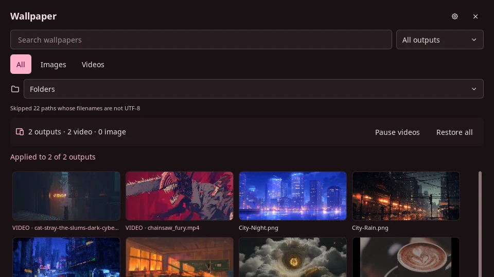

# gSlapper Wallpaper for Noctalia

This repository provides `nomadcxx/gslapper`, a Noctalia v5 plugin for image
and video wallpapers. You can assign one wallpaper to every output or choose a
different file for each connector.



Install [gSlapper](https://github.com/GhostNaN/gSlapper) 1.5.2 or newer,
`find`, `gst-launch-1.0`, `pkill`, and `socat`, then add this Git source:

```sh
noctalia msg plugins source add gslapper git https://github.com/Nomadcxx/noctalia-gslapper
```

Enable `nomadcxx/gslapper` in Noctalia's plugin settings. See the
[plugin README](gslapper/README.md) for the exact bar-widget steps,
configuration, commands, and runtime side effects.

Run the panel pagination check from the repository root:

```sh
lua tests/panel-selftest.lua
```
